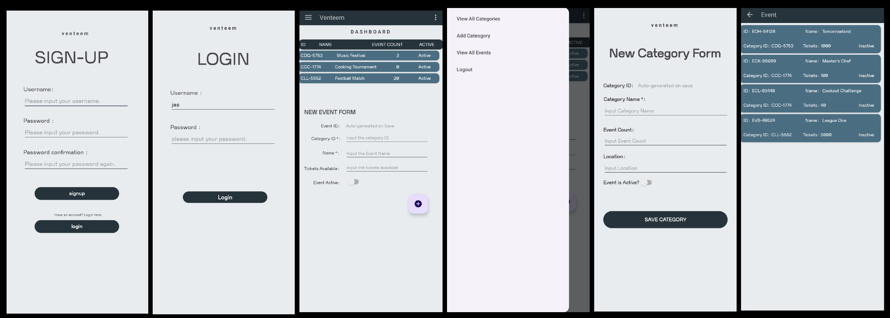

# Venteem - Android Event Management Application

## Overview

This Android application is designed to manage events efficiently. It allows users to view, create, and manage event categories and individual events. The app also integrates with Google Maps to display event locations.



## Features

- **Event Categories**: View and manage different categories of events.
- **Event Details**: View detailed information about each event.
- **Google Maps Integration**: Display event locations on a map.
- **User Authentication**: Sign up and log in to manage events.

## Project Structure

The project is organized into several key components:

- **Activities**: Handle the user interface and user interactions.
- **Adapters**: Manage the data for RecyclerViews.
- **Layouts**: Define the UI components and their arrangement.

## Setup and Installation

### Prerequisites

- Android Studio
- Java Development Kit (JDK) 17 or higher
- Gradle

### Steps

1. **Clone the Repository**:
    ```sh
    git clone https://github.com/your-repo/event-management-app.git
    ```

2. **Open in Android Studio**:
    - Open Android Studio.
    - Select "Open an existing Android Studio project".
    - Navigate to the cloned repository and select it.

3. **Build the Project**:
    - Click on "Build" in the top menu.
    - Select "Make Project" to build the project.

4. **Run the Application**:
    - Connect an Android device or start an emulator.
    - Click on the "Run" button or select "Run" from the top menu.

## Usage

### User Authentication

- **Sign Up**: Create a new account using the sign-up form.
- **Log In**: Log in using your credentials to access the event management features.

### Managing Events

- **View Categories**: Navigate to the category list to view different event categories.
- **View Events**: Select a category to view the events within that category.
- **Event Details**: Click on an event to view detailed information.
- **Map View**: View the event location on Google Maps by clicking on the map icon.

## Contributing

1. Fork the repository.
2. Create a new branch (`git checkout -b feature-branch`).
3. Make your changes.
4. Commit your changes (`git commit -m 'Add some feature'`).
5. Push to the branch (`git push origin feature-branch`).
6. Open a pull request.

## License

Creative Commons Attribution-NonCommercial 4.0 International (CC BY-NC 4.0)

You are free to:
- Share — copy and redistribute the material in any medium or format
- Adapt — remix, transform, and build upon the material

Under the following terms:
- Attribution — You must give appropriate credit, provide a link to the license, and indicate if changes were made. You may do so in any reasonable manner, but not in any way that suggests the licensor endorses you or your use.
- NonCommercial — You may not use the material for commercial purposes.

View the full license at https://creativecommons.org/licenses/by-nc/4.0/

## Contact

For any inquiries or feedback, feel free to contact me :)
